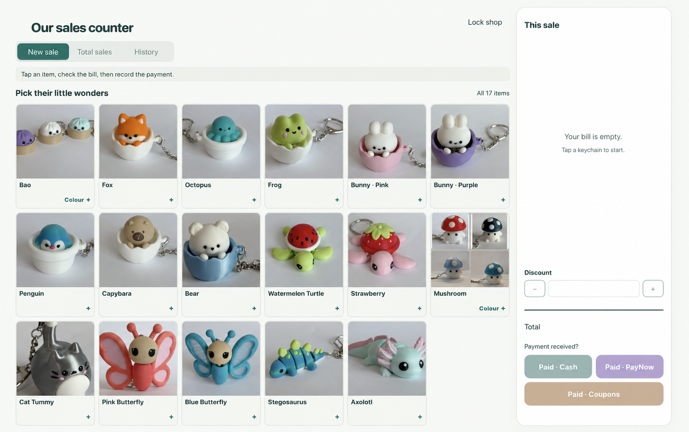

# Community Sales Counter

A free sales counter for family stalls and community fairs. Tap a product, check the bill and record the sale. Build your own version with ChatGPT—no coding experience needed.

*This example shows what you can make. Your app starts blank, ready for your own products, photos and prices.*

## Get started

1. **[Download the ZIP](https://github.com/chowminyang/community-sales-counter/archive/refs/heads/main.zip).** Save it on your computer.
2. **Have a ChatGPT Plus account with Sites access.** Check that Sites is available in your account before starting. [Check availability](https://help.openai.com/en/articles/20001339).
3. **Prepare one Word document or PDF** with your shop name, currency, and a photo, name and price for every product. Include each colour or size separately if needed.
4. **Attach the ZIP and your product file to ChatGPT**, where Sites is available. Use the short message in the [simple walkthrough](docs/CHATGPT-QUICKSTART.md).
5. **Let ChatGPT build it and help you set your own password.** Ask it to create a database too, so your sales are saved when you close the app. No password is included in this download.
6. **Check the photos and prices, try a pretend sale, then publish.** ChatGPT will give you a link to open on your tablet or phone.

**[Follow the simple walkthrough →](docs/CHATGPT-QUICKSTART.md)**

The app is free under the [MIT licence](LICENSE). ChatGPT or hosting charges may apply. It records payments you have received; it does not collect money. Keep it online while selling. Parents and adult organisers should manage the app.

## Want to edit the code yourself?

[Developer instructions](docs/DEVELOPERS.md) · [Customisation](docs/CUSTOMISATION.md) · [Deployment](docs/DEPLOYMENT.md) · [Third-party notices](THIRD_PARTY_NOTICES.md)
